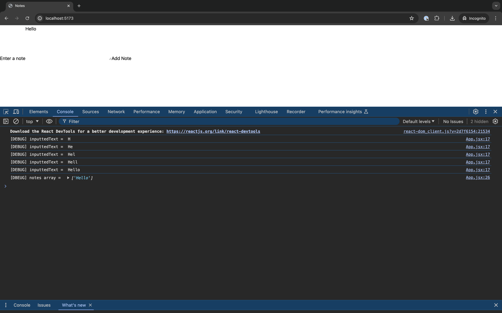

# `2023/part/1-add-notes` React Workshop: Build a Notes App

This branch includes the changes we made during the first section of the workshop.



## Setup

### Prerequisites
Make sure you have the following installed on your machine:

- [Node.js (version 12 or higher)](https://nodejs.org/en/download/current)
  - npm (usually comes bundled with Node.js)
- [nvm](https://github.com/nvm-sh/nvm)
- [Git](https://git-scm.com/book/en/v2/Getting-Started-Installing-Git) and [GitHub Desktop](https://desktop.github.com/)
- Any code editor, I use [vscode](https://code.visualstudio.com/)


### Running locally
This boilerplate is created using [Vite](https://vitejs.dev/guide/). To run your Vite React app in development mode, follow the steps below:

1. Navigate to the Project Directory
Open your terminal or command prompt and navigate to the root directory of your Vite React app.

```bash
cd workshop-notes-app
```

2. Install Dependencies
Before starting the development server, you need to install the project dependencies specified in the package.json file.

    1. Run the following command to make sure you are using the correct node version:

    ```bash
    nvm use
    ```

    2. After that, run the following command to install the packages required for this to run:

    ```bash
    npm install
    ```
    This will fetch and install the required dependencies for your React app using the correct node version specifed in the nvmrc file.

3. Start the Development Server
Once the dependencies are installed, you can start the development server using the following command:

```bash
npm run dev
```
This command will start the Vite development server, which will compile your React app and provide a development environment.

4. Access Your App
After starting the development server, you will see a message indicating that the server is running and which port it's listening on. By default, it should be http://localhost:5173.

Open your web browser and navigate to the provided URL. You should see your Vite React app running in the browser.

5. Begin Development
You can now start making changes to your React app's source code. Vite will automatically update the app in the browser whenever you save a file, thanks to its hot module replacement feature.

As you modify your code, you can observe the changes being reflected in the browser without needing to manually refresh the page.

6. Stopping the Development Server
To stop the development server, go to the terminal or command prompt and press Ctrl + C. Confirm the termination when prompted.
